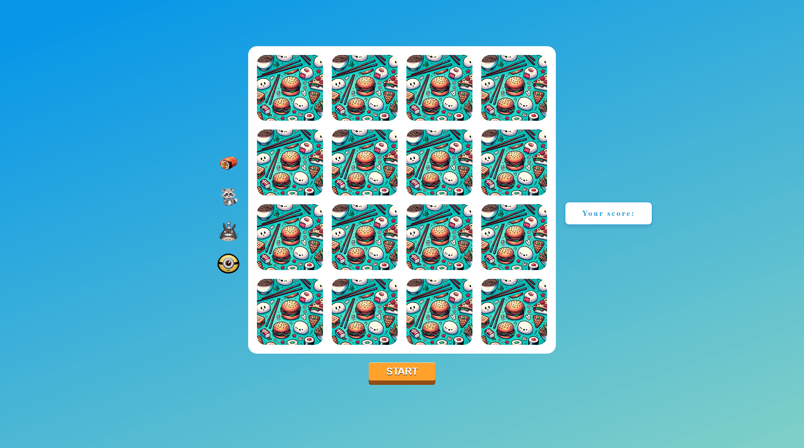

# 🧠 Memory Game

A browser-based memory matching game where users flip cards to find pairs. Includes custom themes, sound effects, and responsive design.

**🔗 Live Demo**: [Memory Game](https://dobbyssockk.github.io/memory-game/)

---

## 🚀 Features

- Flip cards to find matching pairs
- Multiple visual themes (food, animals, anime)
- Click sound effects and match feedback
- Game reset and replay functionality
- Fully responsive for desktop and mobile
- Custom mouse cursors per theme

---

## 🛠️ Technologies Used

- **HTML5** – structure and semantic layout
- **CSS3** – layout, custom styling, animations, and media queries
- **JavaScript (Vanilla)** – core game logic and state handling
- **Audio** – sound effects for interaction

---

## 💡 Key Concepts

- **DOM manipulation**: create and update cards dynamically
- **Event-driven programming**: handle clicks, game start/reset
- **Game state management**: control match logic, timing, and interactivity
- **Responsive design**: adapt layout with CSS media queries
- **User experience**: enhance engagement with sound and custom visuals
